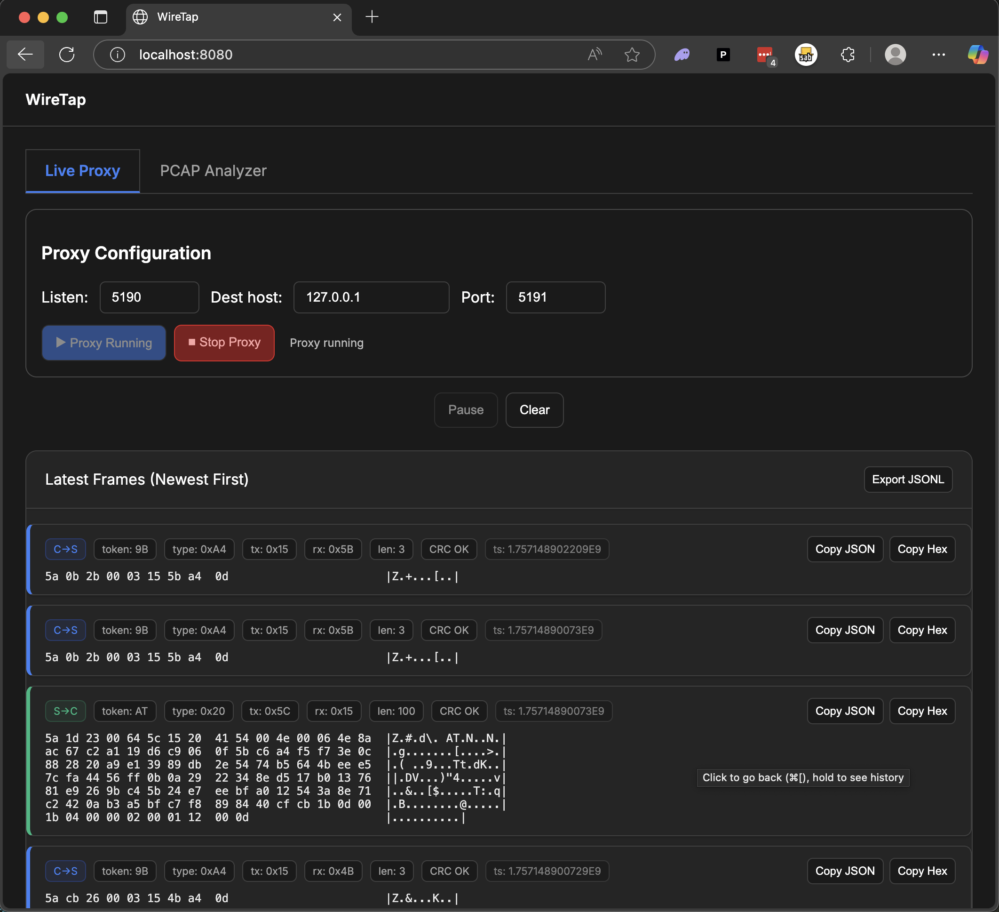
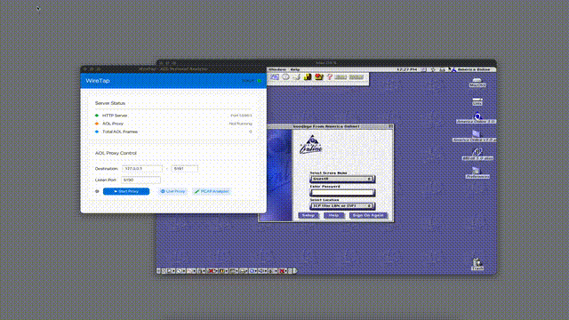

#  WireTap

A network protocol analyzer and packet capture tool designed specifically for reverse engineering and analyzing the AOL protocol.

## Screenshot



*The WireTap web interface showing real-time AOL protocol analysis and packet capture.*

## Demo



*Demonstration of the reverse-engineered dialtone server working through the WireTap proxy, showing real-time protocol analysis. [Full video available](dialtone_wiretap_demo.mp4)*

## Features

- **Real-time AOL Protocol Analysis** - Live packet capture and dissection
- **PCAP File Processing** - Analyze captured network traffic from PCAP files
- **Interactive GUI** - Native application with proxy controls and status monitoring
- **Web Interface** - Browser-based dashboard for remote access
- **JSONL Export/Import** - Save and load analysis sessions
- **TCP Proxy** - Intercept and analyze AOL network traffic
- **AtomForge Integration** - On-demand FDO decompilation for reverse engineering
- **Verbose Logging** - Optional debug output for troubleshooting

## Running the Application

Download the appropriate binary for your platform from the [latest release](https://github.com/iconidentify/wiretap/releases/latest).

### macOS
```bash
# Remove quarantine attribute (required for unsigned binaries)
xattr -c wiretap-macos-arm64

# Run the application
./wiretap-macos-arm64
```

### Windows
```bash
# Run the executable - Windows will show a security warning for unsigned binaries
wiretap-windows-x64.exe
```

**Note**: Windows will display a security warning since the binary is unsigned. Click "Run anyway" to proceed. The application will work normally despite the warning.

## Command Line Options

- `--help` - Show help message
- `--port <port>` - Set web interface port (default: 8080)
- `--server-port <port>` - Set proxy listen port (default: 5190)
- `--no-gui` - Run in headless server mode
- `--pcap <file>` - Analyze PCAP or JSONL file
- `--out <dir>` - Output directory for analysis
- `--pretty` - Pretty-print JSON output
- `--verbose` or `-v` - Enable verbose debug logging

## Usage Examples

### Start GUI Application
```bash
./wiretap-macos-arm64
```

### Run Headless Server
```bash
./wiretap-macos-arm64 --no-gui --port 3000
```

### Analyze PCAP File
```bash
./wiretap-macos-arm64 --pcap capture.pcap --out analysis
```

### Enable Verbose Logging
```bash
./wiretap-macos-arm64 --verbose
# or
./wiretap-macos-arm64 -v
```

## JSONL Format

WireTap uses JSONL (JSON Lines) format for saving and loading analysis sessions. Each line contains a complete JSON object representing a captured frame.

### Example JSONL Entry:
```json
{"timestamp":"2025-01-01T12:00:00Z","source":"192.168.1.1:1234","destination":"10.0.0.1:5190","protocol":"AOL","data":"...","tokens":[{"type":"AUTH","value":"..."}]}
```

### Saving Sessions
- Sessions are automatically saved during live capture
- Use the web interface to export sessions as JSONL files
- Command line analysis outputs JSONL format by default

### Loading Sessions
- Upload JSONL files through the web interface
- Use `--pcap session.jsonl` to load and analyze saved sessions
- Sessions persist across application restarts

## PCAP File Analysis

WireTap can process standard PCAP files captured by tools like Wireshark, tcpdump, or other network capture utilities.

### Analyzing PCAP Files:
```bash
# Analyze PCAP file
./wiretap-macos-arm64 --pcap network_capture.pcap

# Save analysis results
./wiretap-macos-arm64 --pcap network_capture.pcap --out analysis_results
```

## AtomForge Integration

WireTap integrates with [AtomForge](https://github.com/iconidentify/atom-forge) to provide on-demand FDO (File Description Object) decompilation. This allows you to view the decompiled source code of AOL protocol frames directly in the web interface.

### Setup:
1. Install and run AtomForge on `http://localhost:8000`
2. WireTap will automatically detect the AtomForge service
3. Click "Show FDO" on any frame in the web interface to decompile it

The GUI displays AtomForge connection status and version information when available.

## License

This project is licensed under the MIT License - see the [LICENSE](LICENSE) file for details.

## Disclaimer

This tool is for educational and research purposes only. Ensure you have proper authorization before capturing or analyzing network traffic.
